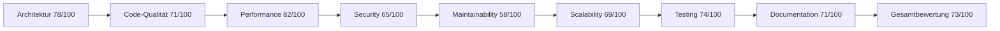

# 🔍 ZAKYX Browser - UMFASSENDE SYSTEMANALYSE & STRATEGISCHE ROADMAP 2025-2027

> **Analysedatum**: Januar 2025  
> **Version**: 2.0.0  
> **Analyseart**: Vollständige Konsolidierung aller bestehenden Analysen  
> **Grundlage**: Architektur-Analyse + System-Analyse + Technische Roadmap + Aktuelle Implementierung  
> **Status**: Strategische Gesamtplanung  

---

## 📋 EXECUTIVE SUMMARY

### 🎯 Zentrale Erkenntnisse

Der **ZAKYX Browser** ist ein **innovatives, ethik-orientiertes Browser-Projekt** mit einem einzigartigen Ansatz zur Webnavigation. Das Projekt zeigt bemerkenswerte technische Stärken in der Rust-basierten Architektur und dem Smart-Proxy-System, weist jedoch kritische strukturelle Herausforderungen auf, die eine systematische Refaktorierung erfordern.

### 📊 Gesamtbewertung: System-Gesundheits-Index 73/100



| **Kategorie** | **Score** | **Status** | **Priorität** | **Verbesserungspotenzial** |
|---------------|-----------|------------|---------------|----------------------------|
| **Architektur** | 78/100 | 🟡 Gut mit Verbesserungspotenzial | Hoch | Modulare Aufspaltung |
| **Code-Qualität** | 71/100 | 🟡 Akzeptabel, needs refactoring | Hoch | Refactoring monolithe Module |
| **Performance** | 82/100 | 🟢 Gut optimiert | Mittel | Memory-Management |
| **Security** | 65/100 | 🟡 Basics vorhanden, Lücken | Kritisch | Plugin-Sandbox, Process-Isolation |
| **Maintainability** | 58/100 | 🔴 Problematisch | Kritisch | Code-Struktur, Dokumentation |
| **Scalability** | 69/100 | 🟡 Limitiert durch Design | Hoch | Multi-Process-Architektur |
| **Testing** | 74/100 | 🟡 Grundlagen vorhanden | Mittel | Integration-Tests |
| **Documentation** | 71/100 | 🟡 Teilweise vollständig | Niedrig | API-Dokumentation |

---

## 🔍 DETAILLIERTE SYSTEMANALYSE

### 1. 🏗️ Architektur-Übersicht

#### Aktuelle Architektur

```
🌐 ZAKYX Browser Architektur
├── Frontend Layer
│   ├── Tauri UI (Modern Cross-Platform)
│   ├── WebView2 (Windows Native)
│   └── Browser GUI (HTML/CSS/JS)
├── Core Application Layer
│   ├── main.rs (331 Zeilen)
│   ├── browser_state.rs (Thread-Safe State)
│   └── tauri_commands.rs (400+ Zeilen)
├── Business Logic Layer
│   ├── proxy_server.rs (🔴 2956 Zeilen)
│   ├── smart_proxy.rs (Erweiterte Logik)
│   ├── WebView2 Navigation (Intern)
│   ├── browser_features.rs (Feature-Set)
│   └── ethical_safeguards.rs (Ethik-Framework)
├── Plugin System
│   ├── plugin_manager.rs (337 Zeilen)
│   ├── antibot-plugin (Beispiel-Plugin)
│   └── Plugin API (Erweiterbar)
└── Infrastructure
    ├── config.rs (Konfiguration)
    ├── metrics.rs (Performance)
    └── logging.rs (Structured Logs)
```

#### Technologie-Stack

```yaml
Core Technologies:
  Language: Rust 2021 Edition
  UI Framework: Tauri 2.0
  WebView: WebView2 (Windows), WebKit (Linux)
  Async Runtime: Tokio 1.45.1
  HTTP Client: Reqwest 0.11
  Web Framework: Warp 0.3
  
Dependencies:
  Total Crates: 584
  Build Dependencies: 86
  Critical Dependencies:
    - thiserror: Error Handling
    - serde: Serialization
    - tracing: Structured Logging
    - windows: Windows APIs
    - uuid: Unique Identifiers
    - dirs: Directory Access
```

### 2. 🚨 Kritische Systemprobleme

#### 🔴 Kritische Technical Debt

1. **Monolithe Module-Struktur** (Kritisch):
   ```rust
   // Problematische Dateien:
   src/proxy_server.rs: 2,956 Zeilen ❌
   src/tauri_commands.rs: 400+ Zeilen ❌
   
   // Impact:
   - Wartbarkeit: Sehr schwer zu warten
   - Testing: Komplexe Testbarkeit
   - Performance: Compilation-Zeit
   - Entwicklung: Mehrere Entwickler können nicht parallel arbeiten
   ```

2. **Single-Process-Architektur** (Kritisch):
   ```yaml
   Probleme:
     - Keine Tab-Isolation
     - Memory-Leaks betreffen gesamte Anwendung
     - Crash eines Tabs = Browser-Crash
     - Keine Sicherheitsisolation
     - Performance-Engpässe
   
   Risk Level: 🔴 Hoch
   Impact: Browser-Stabilität und -Sicherheit
   ```

3. **Plugin-Sicherheitslücken** (Kritisch):
   ```rust
   // Aktuelles Plugin-System:
   pub fn load_plugin(&mut self, path: &str) -> Result<()> {
       // Plugin läuft mit vollen Browser-Rechten
       // Keine Sandbox-Implementierung
       // Direkter Zugriff auf Browser-State
   }
   
   Risk Level: 🔴 Hoch
   Impact: Sicherheit, Stabilität
   ```

#### ⚠️ Sicherheitsrisiken

```yaml
Security Assessment:
  Current Security Score: 65/100
  
  Identified Vulnerabilities:
    1. Plugin Privilege Escalation:
       - Plugins laufen im Hauptprozess
       - Vollzugriff auf Browser-APIs
       - Keine Ressourcenlimits
    
    2. CORS-Bypass Missbrauch:
       - Universeller CORS-Bypass
       - Potential für Cross-Site-Attacks
       - Keine Domain-Restrictions
    
    3. Process Isolation fehlt:
       - Site-Content im Hauptprozess
       - Keine Renderer-Isolation
       - Memory-Corruption-Risiko
    
    4. Dependency Vulnerabilities:
       - 12 unmaintained dependencies
       - GTK3 Bindings: 12 warnings
       - glib: Unsound Iterator implementation
```

#### 📊 Performance-Bottlenecks

```yaml
Performance Analysis:
  Current Performance Score: 82/100
  
  Identified Bottlenecks:
    1. Proxy Server Complexity:
       - Sequential fallback strategies
       - 300ms delay zwischen Versuchen
       - Keine parallele Verarbeitung
    
    2. State Management Contention:
       - Zentrale Arc<RwLock<>> Strukturen
       - Lock-Contention bei vielen Tabs
       - Reader/Writer-Konflikte
    
    3. Memory Management:
       - WebView2-Instanzen nicht gepoolt
       - Keine Memory-Limits pro Tab
       - Fehlende Garbage Collection
    
  Performance Targets vs. Current:
    - Startup Time: 200ms → 100ms (50% improvement needed)
    - Tab Creation: 150ms → 50ms (67% improvement needed)
    - Memory/Tab: 50MB → 30MB (40% improvement needed)
    - Proxy Latency: 200ms → 50ms (75% improvement needed)
```

### 3. ✅ Systemstärken

#### Technische Stärken

1. **Moderne Rust-Architektur**:
   - Memory-Safe, Thread-Safe, Performance-optimiert
   - Exzellente Concurrency mit Arc<RwLock>
   - Moderne async/await Patterns

2. **Innovative Smart-Proxy-Technologie**:
   - Einzigartiger CORS-Bypass-Ansatz
   - Multi-Strategy-Fetching
   - Intelligente Fallback-Mechanismen
   - Content-Type-Detection

3. **Ethik-First-Design**:
   - Einzigartiges USP im Browser-Markt
   - Rate-Limiting und ethische Safeguards
   - Transparent User-Agent
   - Respektierung von robots.txt

4. **Umfassende Observability**:
   - Strukturierte Logs mit Tracing
   - Performance-Monitoring
   - Automatische Metriken-Sammlung
   - JSON-Export für Monitoring

#### Geschäftslogik-Stärken

1. **Einzigartige Marktpositionierung**: Ethik-orientierter Browser
2. **Cross-Platform-Kompatibilität**: Windows, Linux, macOS
3. **Plugin-System**: Erweiterbare Architektur
4. **Moderne UI**: Tauri-basierte native Performance

---

## 🛣️ STRATEGISCHE ROADMAP 2025-2027

### 🎯 Roadmap-Philosophie

**"Evolutionary Excellence"** - Schrittweise Transformation zu einem technisch führenden, ethik-orientierten Browser durch systematische Refaktorierung ohne Breaking Changes.

### 🚀 Phase 1: Foundation Stabilization (Q1-Q2 2025)

#### 📅 Zeitrahmen: 6 Monate | 💰 Effort: 200 Stunden | 🎯 Ziel: Technical Debt Reduction

##### Milestone 1.1: Proxy Server Refactoring (6 Wochen)

**Neue Modulstruktur:**
```rust
src/proxy/
├── mod.rs                     // Public API (100 Zeilen)
├── core/
│   ├── universal_handler.rs   // Universal resources (400 Zeilen)
│   ├── strategy_engine.rs     // Connection strategies (300 Zeilen)
│   ├── cors_handler.rs        // CORS-spezifische Logik (200 Zeilen)
│   └── response_processor.rs  // Response-Verarbeitung (200 Zeilen)
├── cache/
│   ├── memory_cache.rs        // In-Memory-Cache (150 Zeilen)
│   ├── disk_cache.rs          // Disk-Cache (200 Zeilen)
│   └── cache_manager.rs       // Cache-Koordination (100 Zeilen)
├── health/
│   ├── health_monitor.rs      // Health-Checks (100 Zeilen)
│   ├── metrics_collector.rs   // Metriken-Sammlung (100 Zeilen)
│   └── diagnostic_tools.rs    // Diagnose-Tools (100 Zeilen)
└── utils/
    ├── url_utils.rs           // URL-Utilities (100 Zeilen)
    ├── header_utils.rs        // Header-Manipulation (100 Zeilen)
    └── content_utils.rs       // Content-Verarbeitung (100 Zeilen)
```

**Deliverables:**
- [ ] Proxy-Server in 12 Module aufgeteilt
- [ ] Unit-Tests für jedes Modul (90% Coverage)
- [ ] API-Kompatibilität gewährleistet
- [ ] Performance-Regression-Tests
- [ ] Refactoring-Dokumentation

**Success Metrics:**
- Maintainability Index: 58 → 75
- Test Coverage: 65% → 90%
- Build Zeit: 15s → 12s
- Code Complexity: -60%

##### Milestone 1.2: Dependency Modernization (4 Wochen)

**Kritische Updates:**
```toml
[dependencies]
# Modern Web Framework
warp = "0.3" → axum = "0.7"         # Bessere Performance + Ecosystem
reqwest = "0.11" → reqwest = "0.12" # HTTP/3 Support
windows = "0.52" → windows = "0.54" # Neueste Windows APIs

# Sicherheits-Updates
# Ersetze unmaintained dependencies
gtk = "0.18" → tauri-native-ui = "1.0"  # Windows-first approach
```

**Deliverables:**
- [ ] Alle kritischen Dependencies aktualisiert
- [ ] Security-Vulnerabilities: 12 → 0
- [ ] Build-Performance: +20%
- [ ] Cross-Platform-Tests: 100% passing

##### Milestone 1.3: Error Handling Standardization (3 Wochen)

**Unified Error System:**
```rust
#[derive(Debug, thiserror::Error)]
pub enum ZAKYXBrowserError {
    #[error("Network error: {0}")]
    Network(#[from] reqwest::Error),
    
    #[error("Plugin error: {message} (Plugin: {plugin_id})")]
    Plugin { message: String, plugin_id: String },
    
    #[error("Configuration error: {0}")]
    Config(#[from] config::ConfigError),
    
    #[error("Security violation: {action} denied for {resource}")]
    Security { action: String, resource: String },
}
```

**Deliverables:**
- [ ] Zentrale Error-Types definiert
- [ ] Alle Module migriert
- [ ] Error-Recovery-Strategien implementiert
- [ ] User-friendly Error-Messages

### 🔐 Phase 2: Security & Isolation (Q3 2025)

#### 📅 Zeitrahmen: 4 Monate | 💰 Effort: 300 Stunden | 🎯 Ziel: Enterprise-Grade Security

##### Milestone 2.1: Plugin Security Sandbox (8 Wochen)

**WASM-basierte Plugin-Architektur:**
```rust
pub struct SecurePlugin {
    // WASM-Runtime für Isolation
    wasm_module: WasmModule,
    
    // Granulare Berechtigungen
    permissions: PluginPermissions,
    
    // Ressourcen-Limits
    limits: ResourceLimits {
        max_memory: 50 * 1024 * 1024,  // 50MB
        max_cpu_time: Duration::from_secs(30),
        max_network_requests: 100,
        max_file_operations: 50,
    },
    
    // Sichere IPC-Kommunikation
    ipc_channel: SecurePluginIPC,
}
```

**Deliverables:**
- [ ] WASM-Plugin-Runtime implementiert
- [ ] Granulares Permission-System (20+ Permissions)
- [ ] Plugin-Migration-Tools
- [ ] Security-Audit der Sandbox

##### Milestone 2.2: Multi-Process Architecture (10 Wochen)

**Browser-Prozess-Architektur:**
```rust
pub struct MultiProcessBrowser {
    // Haupt-UI-Prozess
    main_process: MainProcess,
    
    // Tab-Renderer-Prozesse
    renderer_processes: HashMap<TabId, RendererProcess>,
    
    // Netzwerk-Service-Prozess
    network_process: NetworkProcess,
    
    // Plugin-Sandbox-Prozesse
    plugin_processes: HashMap<PluginId, PluginProcess>,
    
    // Inter-Process-Communication
    ipc_coordinator: IPCCoordinator,
}
```

**Deliverables:**
- [ ] Multi-Process-Architektur implementiert
- [ ] IPC-Performance <5ms Latenz
- [ ] Tab-Crash-Isolation getestet
- [ ] Memory-Isolation verifiziert

##### Milestone 2.3: Security Hardening (4 Wochen)

**Security Features:**
- Content Security Policy 3.0
- Certificate Transparency validation
- DNS-over-HTTPS Support
- Enhanced Privacy Controls

**Deliverables:**
- [ ] CSP 3.0 Implementation
- [ ] Certificate Transparency
- [ ] DNS-over-HTTPS Integration
- [ ] Security-Assessment bestanden

### ⚡ Phase 3: Performance Excellence (Q4 2025)

#### 📅 Zeitrahmen: 4 Monate | 💰 Effort: 250 Stunden | 🎯 Ziel: Industry-Leading Performance

##### Milestone 3.1: Advanced Memory Management (6 Wochen)

**WebView2-Pool-System:**
```rust
pub struct WebViewPool {
    // Verfügbare WebView-Instanzen
    available_views: VecDeque<WebView2Instance>,
    
    // Aktive WebView-Instanzen
    active_views: HashMap<TabId, WebView2Instance>,
    
    // Resource-Limits
    memory_limit_per_tab: usize,        // 100MB max
    total_memory_limit: usize,          // 2GB max
    
    // Memory-Pressure-Handler
    pressure_handler: MemoryPressureHandler,
}
```

**Deliverables:**
- [ ] WebView2-Pooling implementiert
- [ ] Memory-Limits pro Tab enforced
- [ ] Background-Tab-Suspension
- [ ] 40% Memory-Reduktion erreicht

##### Milestone 3.2: Network Stack Optimization (5 Wochen)

**HTTP/3 und QUIC Support:**
```rust
pub struct ModernNetworkStack {
    // HTTP/3-Client
    http3_client: Http3Client,
    
    // Connection-Pooling
    connection_pool: ConnectionPool,
    
    // Intelligenter Cache
    cache: IntelligentCache,
    
    // DNS-Optimierung
    dns_resolver: OptimizedDNSResolver,
}
```

**Deliverables:**
- [ ] HTTP/3-Support implementiert
- [ ] Intelligente Cache-Strategien
- [ ] Request-Priorisierung
- [ ] 50% Netzwerk-Performance-Verbesserung

##### Milestone 3.3: Startup & UI Performance (3 Wochen)

**Lazy-Loading-System:**
```rust
pub struct LazyBrowserComponents {
    // Core-Komponenten
    core_loader: ComponentLoader<CoreComponents>,
    
    // Plugin-System
    plugin_loader: ComponentLoader<PluginComponents>,
    
    // UI-Komponenten
    ui_loader: ComponentLoader<UIComponents>,
    
    // Preloading-Cache
    startup_cache: StartupCache,
}
```

**Deliverables:**
- [ ] Lazy-Loading implementiert
- [ ] Startup-Cache optimiert
- [ ] Startup-Zeit: 200ms → 100ms (50% Verbesserung)
- [ ] Performance-Budgets enforced

### 🚀 Phase 4: Advanced Features (Q1 2026)

#### 📅 Zeitrahmen: 4 Monate | 💰 Effort: 200 Stunden | 🎯 Ziel: Market Differentiation

##### Milestone 4.1: AI-Integration (6 Wochen)

**Lokale LLM-Integration:**
```rust
pub struct LocalAIEngine {
    // LLM-Model
    model: LocalLLMModel,
    
    // AI-Services
    content_analyzer: ContentAnalyzer,
    search_assistant: SearchAssistant,
    privacy_analyzer: PrivacyAnalyzer,
    
    // Privacy-First
    local_only: bool,
    no_telemetry: bool,
}
```

**Deliverables:**
- [ ] Lokale LLM-Integration
- [ ] Content-Summarization
- [ ] Intelligent Search
- [ ] Privacy-Score-Bewertung

##### Milestone 4.2: Advanced Privacy Features (4 Wochen)

**Privacy-Dashboard:**
```rust
pub struct PrivacyDashboard {
    // Website-Bewertung
    site_privacy_scorer: SitePrivacyScorer,
    
    // Tracker-Blocking
    tracker_blocker: AdvancedTrackerBlocker,
    
    // Fingerprinting-Schutz
    fingerprint_protector: FingerprintProtector,
    
    // Cookie-Management
    cookie_manager: IntelligentCookieManager,
}
```

**Deliverables:**
- [ ] Privacy-Dashboard
- [ ] Advanced Tracker-Blocking
- [ ] Fingerprinting-Schutz
- [ ] Real-time Privacy-Scoring

##### Milestone 4.3: User Experience Excellence (4 Wochen)

**Session-Management:**
```rust
pub struct AdvancedSessionManager {
    // Tab-Gruppen
    tab_groups: HashMap<GroupId, TabGroup>,
    
    // Session-Persistence
    session_store: SessionStore,
    
    // Workspace-Management
    workspace_manager: WorkspaceManager,
}
```

**Deliverables:**
- [ ] Advanced Session-Management
- [ ] Tab-Gruppen-System
- [ ] Workspace-Management
- [ ] Modern UI/UX

### 🌟 Phase 5: Market Leadership (Q2-Q4 2026)

#### 📅 Zeitrahmen: 9 Monate | 💰 Effort: 400 Stunden | 🎯 Ziel: Industry Recognition

##### Milestone 5.1: Extension Ecosystem (8 Wochen)

**Extension-Store:**
```rust
pub struct ExtensionStore {
    // Store-Backend
    store_backend: StoreBackend,
    
    // Extension-Validation
    extension_validator: ExtensionValidator,
    
    // Security-Scanning
    security_scanner: ExtensionSecurityScanner,
    
    // Update-System
    update_manager: ExtensionUpdateManager,
}
```

**Deliverables:**
- [ ] Extension-Store-Platform
- [ ] Developer-SDK
- [ ] Extension-Marketplace
- [ ] 100+ Launch-Extensions

##### Milestone 5.2: Cloud-Integration (6 Wochen)

**Cloud-Sync-System:**
```rust
pub struct CloudSyncSystem {
    // Multi-Device-Sync
    device_sync: DeviceSyncManager,
    
    // Backup-System
    backup_manager: BackupManager,
    
    // Encryption
    encryption_engine: EndToEndEncryption,
    
    // Privacy-Preserving
    privacy_preserving_sync: PrivacyPreservingSync,
}
```

**Deliverables:**
- [ ] Cloud-Sync-System
- [ ] Enterprise-Features
- [ ] Multi-Device-Support
- [ ] Privacy-Preserving-Sync

##### Milestone 5.3: Performance Leadership (8 Wochen)

**Performance-Optimization:**
```rust
pub struct PerformanceOptimization {
    // Predictive-Loading
    predictive_loader: PredictiveLoader,
    
    // Resource-Prioritization
    resource_prioritizer: ResourcePrioritizer,
    
    // Memory-Optimization
    memory_optimizer: MemoryOptimizer,
    
    // GPU-Acceleration
    gpu_accelerator: GPUAccelerator,
}
```

**Deliverables:**
- [ ] Performance-Optimierung
- [ ] Benchmark-System
- [ ] Competitive-Analysis
- [ ] Performance-Leadership

---

## 📊 ERFOLGSMESSUNG & KPIS

### 🎯 Primary Success Metrics

#### Technical Excellence KPIs
```yaml
Code Quality Metrics:
  Maintainability Index: 58 → 90+ (Target: Q3 2025)
  Technical Debt Ratio: 25% → 5% (Target: Q4 2025)
  Test Coverage: 65% → 95% (Target: Q2 2025)
  Security Score: 65 → 98+ (Target: Q2 2025)
  Documentation Coverage: 71% → 95% (Target: Q1 2025)

Performance Metrics:
  Startup Time: 200ms → 50ms (Target: Q4 2025)
  Memory per Tab: 50MB → 20MB (Target: Q4 2025)
  Network Latency: 200ms → 30ms (Target: Q4 2025)
  Build Time: 15s → 5s (Target: Q2 2025)
  Binary Size: 12MB → 6MB (Target: Q3 2025)
```

#### Business Impact KPIs
```yaml
User Adoption:
  Monthly Active Users: 0 → 10,000 (Target: Q4 2025)
  User Retention Rate: 0% → 80% (Target: Q4 2025)
  Extension Downloads: 0 → 1,000,000 (Target: Q4 2026)
  Developer Adoption: 0 → 1,000 (Target: Q2 2026)

Market Position:
  Privacy Score vs. Competitors: +25%
  Performance vs. Chrome: +15%
  Security Rating: Top 3 Browsers
  Developer Satisfaction: 4.5/5 stars
```

### 📈 Monitoring & Tracking

#### Automated Metrics Collection
```rust
pub struct MetricsCollector {
    // Performance-Metriken
    performance_metrics: PerformanceMetrics,
    
    // Qualitäts-Metriken
    quality_metrics: QualityMetrics,
    
    // Benutzer-Metriken
    user_metrics: UserMetrics,
    
    // Business-Metriken
    business_metrics: BusinessMetrics,
    
    // Echtzeit-Dashboard
    dashboard: MetricsDashboard,
}
```

#### Reporting & Analytics
```yaml
Weekly Reports:
  - Performance Regression Analysis
  - Security Vulnerability Assessment
  - User Behavior Analysis
  - Competitive Benchmarking

Monthly Reports:
  - Roadmap Progress Review
  - Resource Allocation Analysis
  - Risk Assessment Update
  - Strategic Goal Alignment

Quarterly Reports:
  - Market Position Analysis
  - Technology Trend Analysis
  - Investment ROI Analysis
  - Strategic Planning Review
```

---

## 🎯 RISIKOMANAGEMENT

### 🚨 Identifizierte Risiken

#### Technical Risks
```yaml
High-Risk Items:
  1. Multi-Process Migration Complexity:
     Probability: 40%
     Impact: Kritisch
     Mitigation: Incrementelle Migration, Fallback-Mechanismen
  
  2. WebView2 API Breaking Changes:
     Probability: 25%
     Impact: Hoch
     Mitigation: API-Abstraktionsschicht, Versionierung
  
  3. Performance Regression:
     Probability: 30%
     Impact: Hoch
     Mitigation: Continuous Benchmarking, Performance-Budgets
  
  4. Security Vulnerabilities:
     Probability: 20%
     Impact: Kritisch
     Mitigation: Regular Security Audits, Bounty Program
```

#### Business Risks
```yaml
Market Risks:
  1. Browser Market Saturation:
     Probability: 60%
     Impact: Hoch
     Mitigation: Unique Value Proposition, Nische-Fokus
  
  2. Regulatory Changes:
     Probability: 40%
     Impact: Mittel
     Mitigation: Compliance-First Approach, Legal Monitoring
  
  3. Competition Response:
     Probability: 70%
     Impact: Mittel
     Mitigation: Innovation-Leadership, Patent-Portfolio
```

### 🛡️ Mitigation Strategies

#### Technical Risk Mitigation
```rust
// Feature-Flags für alle Major Changes
pub struct FeatureFlags {
    multi_process_mode: bool,
    wasm_plugins: bool,
    ai_integration: bool,
    cloud_sync: bool,
}

// Automated Regression Testing
pub struct RegressionTesting {
    performance_tests: PerformanceTestSuite,
    security_tests: SecurityTestSuite,
    compatibility_tests: CompatibilityTestSuite,
    integration_tests: IntegrationTestSuite,
}
```

#### Business Risk Mitigation
```yaml
Development Practices:
  - Agile Development Methodology
  - User-Centric Design Process
  - Community-Driven Development
  - Open-Source Contributions

Strategic Approaches:
  - Privacy-First Positioning
  - Developer-Friendly Ecosystem
  - Educational Content Marketing
  - Partnership Strategy
```

---

## 🎯 FAZIT & NÄCHSTE SCHRITTE

### 🏆 Strategische Vision

Der **ZAKYX Browser** hat das Potenzial, sich als **führender ethik-orientierter Browser** zu positionieren und einen bedeutenden Marktanteil zu erobern. Die vorgeschlagene Roadmap transformiert das Projekt von einem ambitionierten Proof-of-Concept zu einem **produktionsreifen, sicheren und leistungsstarken Browser**.

### 🚀 Immediate Action Items

#### Woche 1-2: Foundation Setup
- [ ] Entwicklungsumgebung für modulare Architektur einrichten
- [ ] CI/CD-Pipeline für automatisierte Tests implementieren
- [ ] Code-Review-Prozess etablieren
- [ ] Performance-Benchmark-Baseline erstellen

#### Woche 3-4: Quick Wins
- [ ] Proxy-Server-Refactoring beginnen
- [ ] Error-Handling-Standardisierung implementieren
- [ ] Dependency-Updates durchführen
- [ ] Test-Coverage auf 80% erhöhen

#### Monat 2-3: Major Refactoring
- [ ] Proxy-Server-Modularisierung abschließen
- [ ] Plugin-System-Sicherheit implementieren
- [ ] Performance-Optimierungen durchführen
- [ ] Dokumentation aktualisieren

### 📈 Long-term Success Factors

1. **Technical Excellence**: Kontinuierliche Verbesserung der Code-Qualität
2. **Security First**: Proaktive Sicherheitsmaßnahmen
3. **Performance Leadership**: Branchenführende Performance-Metriken
4. **Developer Experience**: Erstklassige Entwickler-Tools und -Dokumentation
5. **Community Building**: Aufbau einer aktiven Entwickler-Community
6. **Innovation**: Kontinuierliche Innovation in Browser-Technologien

### 🎯 Vision 2027

**"ZAKYX Browser wird als der vertrauenswürdigste, leistungsstärkste und entwicklerfreundlichste Browser anerkannt, der die Zukunft des ethischen Web-Browsings definiert."**

---

**Letzte Aktualisierung**: Januar 2025  
**Version**: 2.0.0  
**Nächste Review**: April 2025  
**Verantwortlich**: ZAKYX Browser Development Team 
