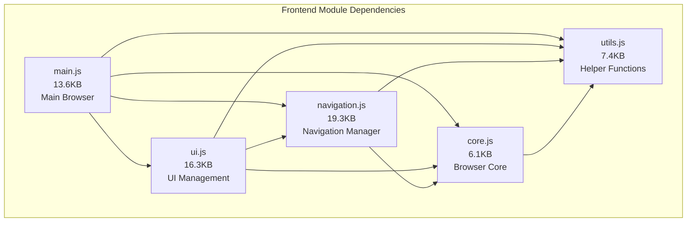

# 🎨 OraBrowser - Frontend-Architektur-Dokumentation

> **Version**: 1.0.0+  
> **Datum**: Dezember 2024  
> **Architektur**: Modulares ES6-System  
> **Status**: Production-Ready ✅  

---

## 📋 Übersicht

Das **OraBrowser Frontend** wurde von einer **monolithischen 66KB-Datei** zu einem **modularen ES6-System** mit **5 spezialisierten Modulen** refactored. Diese Architektur bietet bessere **Maintainability**, **Performance** und **Testbarkeit**.

### **🎯 Architektur-Prinzipien**

- ✅ **Separation of Concerns**: Jedes Modul hat eine spezifische Verantwortung
- ✅ **ES6 Module System**: Native import/export-Statements
- ✅ **Class-based Design**: Objektorientierte Struktur
- ✅ **Dependency Injection**: Lose gekoppelte Module
- ✅ **Event-driven Communication**: Sichere Inter-Modul-Kommunikation
- ✅ **Error Boundaries**: Robuste Fehlerbehandlung

---

## 🏗️ Modul-Architektur

### **📊 Modul-Übersicht**

| **Modul** | **Größe** | **Verantwortung** | **Dependencies** |
|-----------|-----------|-------------------|------------------|
| `utils.js` | 7.4KB | Helper-Funktionen, Debug-Tools | Keine |
| `core.js` | 6.1KB | Browser-Kern, Settings, Status | utils.js |
| `navigation.js` | 19.3KB | Navigation, Proxy, Content-Optimierung | core.js, utils.js |
| `ui.js` | 16.3KB | Tab-Management, Bookmarks, UI | core.js, navigation.js, utils.js |
| `main.js` | 13.6KB | Hauptklasse, Initialisierung, Events | Alle Module |

### **🔄 Dependency-Graph**



---

## 📁 Detaillierte Modul-Analyse

### **1. 🛠️ utils.js - Foundation Module**

#### **Verantwortung**: Basis-Utilities und Helper-Funktionen

```javascript
// Hauptkomponenten:
- waitForTauri()           // Tauri API-Erkennung
- ErrorHandler             // Globale Fehlerbehandlung
- EventUtils               // Event-Management
- DomUtils                 // DOM-Operationen
- DebugTools               // Performance-Monitoring
- UrlUtils                 // URL-Verarbeitung
```

#### **Klassen-Struktur**:
```javascript
export class ErrorHandler {
    static setupGlobalErrorHandling()
    static logError(error, context)
}

export class EventUtils {
    static addListener(element, event, handler)
    static removeListener(element, event, handler)
}

export class DomUtils {
    static safeGetElement(id)
    static createSafeElement(tag, attributes)
}

export class DebugTools {
    static startPerformanceMonitor()
    static checkElements()
    static memoryUsage()
}
```

#### **Key Features**:
- ✅ **Tauri API Detection**: Asynchrone API-Erkennung mit Fallbacks
- ✅ **Global Error Handling**: Umfassende Fehlerprotokollierung
- ✅ **Safe DOM Operations**: Null-sichere Element-Zugriffe
- ✅ **Performance Monitoring**: Memory- und Performance-Tracking

---

### **2. 🧠 core.js - Browser Core Module**

#### **Verantwortung**: Browser-Kernfunktionalität und State-Management

```javascript
// Hauptklasse:
export class OraBrowserCore {
    constructor()
    initializeCore()
    updateStatus(message)
    getSettings()
    extractDomain(url)
    getSystemStatus()
    getPerformanceMetrics()
}
```

#### **Funktionalitäten**:
- ✅ **Settings Management**: Browser-Einstellungen verwalten
- ✅ **Status Updates**: UI-Status-Nachrichten
- ✅ **URL Processing**: Domain-Extraktion, URL-Normalisierung
- ✅ **System Monitoring**: Performance- und System-Metriken
- ✅ **Current State**: Aktuelle URL und Browser-Zustand

#### **Implementation**:
```javascript
class OraBrowserCore {
    constructor() {
        this.currentUrl = 'about:blank';
        this.settings = {
            homepage: 'https://www.google.com',
            searchEngine: 'https://www.google.com/search?q=',
            enableJavaScript: true,
            enableCookies: true
        };
        this.startTime = Date.now();
    }

    initializeCore() {
        console.log('🚀 OraBrowser Core initialized');
        this.updateStatus('Initialisierung...');
    }

    updateStatus(message) {
        const statusElement = DomUtils.safeGetElement('status-text');
        if (statusElement) {
            statusElement.textContent = message;
        }
        console.log('📊 Status:', message);
    }
}
```

---

### **3. 🧭 navigation.js - Navigation Manager Module**

#### **Verantwortung**: URL-Navigation, Proxy-Kommunikation, Content-Optimierung

```javascript
// Hauptklasse:
export class NavigationManager {
    constructor(core)
    navigateToUrl(url, updateTab, addToHistory)
    tryProxyNavigation(url)
    optimizeContent(content, url)
    createSecurityScript()
    setupLinkInterception()
    goBack() / goForward() / reload()
}
```

#### **Key Features**:

##### **Navigation-Strategien**:
```javascript
// Multi-Strategy Navigation
1. tryProxyNavigation(url)     // Proxy-basierte Navigation
2. handleGoogleNavigation(url) // Google-spezifische Optimierung
3. createIframeFallback(url)   // Fallback für problematische Seiten
```

##### **Content-Optimierung**:
```javascript
optimizeContent(content, url) {
    // 1. Security Script injection
    // 2. Base-Tag für relative URLs
    // 3. External Links in neuem Tab
    // 4. Formulare für Proxy umleiten
    // 5. Content-Type optimieren
}
```

##### **Security-Script**:
```javascript
createSecurityScript() {
    return `
    <script>
    // 1. Link-Interception für interne Navigation
    // 2. Form-Interception für Proxy-Weiterleitung
    // 3. PostMessage-Fallback für iframe-Kommunikation
    // 4. Console-Logging-Optimierung
    </script>`;
}
```

##### **History-Management**:
```javascript
// Browser-ähnliche Verlaufs-Navigation
- addToHistory(url)           // Verlauf hinzufügen
- goBack() / goForward()      // Navigation
- history: Array<string>      // Verlaufs-Array
- historyIndex: number        // Aktuelle Position
```

---

### **4. 🎨 ui.js - UI Management Module**

#### **Verantwortung**: Tab-Management, Bookmark-System, UI-Komponenten

```javascript
// Hauptklassen:
export class TabManager {
    constructor(core, navigationManager)
    createNewTab(url) / closeTab(tabId) / switchToTab(tabId)
    renderTabs() / updateTabTitle(tabId, title)
}

export class BookmarkManager {
    constructor(core, navigationManager)
    addBookmark(title, url) / removeBookmark(id)
    loadBookmarksFromBackend() / saveBookmarkToBackend(bookmark)
    renderBookmarks() / showBookmarkModal()
}
```

#### **Tab-Management-Architektur**:
```javascript
class TabManager {
    constructor(core, navigationManager) {
        this.tabs = [];              // Tab-Array
        this.activeTabId = null;     // Aktuell aktiver Tab
        this.tabCounter = 0;         // Tab-ID-Zähler
        this.core = core;
        this.navigationManager = navigationManager;
    }

    createNewTab(url = null) {
        const tabId = `tab-${++this.tabCounter}`;
        const tab = {
            id: tabId,
            title: url ? this.extractTitle(url) : 'Startseite',
            url: url || 'about:blank',
            isActive: false
        };
        
        this.tabs.push(tab);
        this.renderTabs();
        
        return tabId;
    }
}
```

#### **Bookmark-Management-Architektur**:
```javascript
class BookmarkManager {
    constructor(core, navigationManager) {
        this.bookmarks = [];         // Bookmark-Array
        this.core = core;
        this.navigationManager = navigationManager;
    }

    async addBookmark(title, url) {
        const bookmark = {
            id: Date.now().toString(),
            title: title.trim(),
            url: this.normalizeUrl(url.trim())
        };
        
        // Backend-Speicherung versuchen
        const saved = await this.saveBookmarkToBackend(bookmark);
        
        if (saved) {
            this.bookmarks.push(bookmark);
            this.renderBookmarks();
            return true;
        }
        
        return false;
    }
}
```

#### **Event-System**:
```javascript
// Tab-Events
setupTabEventListeners() {
    // 1. Tab-Click-Handler
    // 2. Tab-Close-Handler
    // 3. Tab-Context-Menu
    // 4. Drag & Drop (zukünftig)
}

// Bookmark-Events
setupBookmarkEventListeners() {
    // 1. Bookmark-Click-Navigation
    // 2. Bookmark-Context-Menu
    // 3. Bookmark-Drag-Reorder (zukünftig)
}
```

---

### **5. 🚀 main.js - Main Browser Module**

#### **Verantwortung**: Browser-Initialisierung, Event-Koordination, Hauptklasse

```javascript
// Hauptklasse:
class OraBrowser {
    constructor()
    init()                    // Vollständige Initialisierung
    setupUIComponents()       // UI-Setup
    setupEventListeners()     // Global Events
    setupTauriEventListeners() // Backend-Events
    renderInitialUI()         // Initiales Rendering
}
```

#### **Initialisierungs-Pipeline**:
```javascript
async init() {
    try {
        // 1. Core initialisieren
        this.core = new OraBrowserCore();
        this.core.initializeCore();
        
        // 2. Manager initialisieren
        this.navigationManager = new NavigationManager(this.core);
        this.tabManager = new TabManager(this.core, this.navigationManager);
        this.bookmarkManager = new BookmarkManager(this.core, this.navigationManager);
        
        // 3. UI-Setup
        this.setupUIComponents();
        this.setupEventListeners();
        this.setupTauriEventListeners();
        
        // 4. Initial-Data laden
        await this.bookmarkManager.loadBookmarksFromBackend();
        this.tabManager.createInitialTab();
        
        // 5. UI rendern
        this.renderInitialUI();
        
        // 6. Finalisierung
        await waitForTauri(3000);
        this.isInitialized = true;
        
    } catch (error) {
        this.handleInitializationError(error);
    }
}
```

#### **Event-System**:
```javascript
setupEventListeners() {
    // 1. PostMessage für iframe-Kommunikation
    window.addEventListener('message', (event) => {
        if (event.data?.type === 'oraBrowser_navigate') {
            this.navigationManager.navigateToUrl(event.data.url);
        }
    });
    
    // 2. Keyboard-Shortcuts
    document.addEventListener('keydown', (e) => {
        if (e.ctrlKey && e.key === 't') {        // Ctrl+T: Neuer Tab
        if (e.ctrlKey && e.key === 'w') {        // Ctrl+W: Tab schließen
        if (e.ctrlKey && e.key === 'l') {        // Ctrl+L: Address Bar
        if (e.altKey && e.key === 'Home') {      // Alt+Home: Home
    });
}
```

---

## 🔄 Inter-Modul-Kommunikation

### **🎯 Communication Patterns**

#### **1. Constructor Injection**:
```javascript
// Dependencies werden im Constructor übergeben
class NavigationManager {
    constructor(core) {           // ← Dependency Injection
        this.core = core;
    }
}

class TabManager {
    constructor(core, navigationManager) {  // ← Multiple Dependencies
        this.core = core;
        this.navigationManager = navigationManager;
    }
}
```

#### **2. Method Invocation**:
```javascript
// Direkte Methodenaufrufe zwischen Modulen
async navigateToUrl(url) {
    this.core.updateStatus(`Lade ${url}...`);           // ← Core-Aufruf
    const success = await this.tryProxyNavigation(url);
    this.core.updateStatus(`Geladen: ${domain}`);       // ← Core-Aufruf
}
```

#### **3. Event-based Communication**:
```javascript
// PostMessage für iframe-zu-parent-Kommunikation
window.addEventListener('message', (event) => {
    if (event.data?.type === 'oraBrowser_navigate') {
        this.navigationManager.navigateToUrl(event.data.url);
    }
});
```

#### **4. Global State Access**:
```javascript
// Shared State über window-Objekt
window.oraBrowser = new OraBrowser();  // ← Global verfügbar
```

---

## 🏗️ Build & Loading-System

### **📦 ES6 Module Loading**

#### **HTML Integration**:
```html
<!-- ES6 Module Loading -->
<script type="module" src="js/main.js"></script>
<!-- Kein weiteres Script-Tag erforderlich! -->
```

#### **Import-Struktur**:
```javascript
// main.js - Entry Point
import { waitForTauri, ErrorHandler, EventUtils, DomUtils, DebugTools } from './utils.js';
import { OraBrowserCore } from './core.js';
import { NavigationManager } from './navigation.js';
import { TabManager, BookmarkManager } from './ui.js';

// Automatisches Dependency-Loading durch Browser
// - utils.js wird zuerst geladen
// - core.js wird nach utils.js geladen
// - navigation.js wird nach core.js und utils.js geladen
// - ui.js wird nach allen Dependencies geladen
// - main.js wird zuletzt geladen
```

### **⚡ Performance-Optimierungen**

#### **1. Module Caching**:
```javascript
// Browser cached automatisch ES6-Module
// → Wiederverwendung bei mehreren Imports
// → Keine doppelten Downloads
```

#### **2. Lazy Loading** (für Zukunft):
```javascript
// Dynamisches Import für große Features
const { DeveloperTools } = await import('./developer-tools.js');
const { AdvancedBookmarks } = await import('./advanced-bookmarks.js');
```

#### **3. Tree Shaking** (für Zukunft):
```javascript
// Nur verwendete Funktionen importieren
import { addListener, removeListener } from './utils.js';
// → Ungenutzter Code wird nicht geladen
```

---

## 🧪 Testing-Strategie

### **📊 Module-Testing**

#### **Unit Tests**:
```javascript
// utils.js Testing
describe('ErrorHandler', () => {
    test('should setup global error handling', () => {
        ErrorHandler.setupGlobalErrorHandling();
        expect(window.onerror).toBeDefined();
    });
});

// core.js Testing
describe('OraBrowserCore', () => {
    test('should initialize with default settings', () => {
        const core = new OraBrowserCore();
        expect(core.settings.homepage).toBe('https://www.google.com');
    });
});
```

#### **Integration Tests**:
```javascript
// Module-Integration-Tests
describe('NavigationManager Integration', () => {
    test('should update core status during navigation', async () => {
        const core = new OraBrowserCore();
        const nav = new NavigationManager(core);
        
        await nav.navigateToUrl('https://example.com');
        
        expect(core.currentUrl).toBe('https://example.com');
    });
});
```

#### **End-to-End Tests**:
```javascript
// Vollständige Browser-Tests
describe('Full Browser Flow', () => {
    test('should create tab, navigate, and add bookmark', async () => {
        const browser = new OraBrowser();
        await browser.init();
        
        const tabId = browser.tabManager.createNewTab();
        await browser.navigationManager.navigateToUrl('https://example.com');
        await browser.bookmarkManager.addBookmark('Example', 'https://example.com');
        
        expect(browser.bookmarkManager.bookmarks).toHaveLength(1);
    });
});
```

---

## 🔧 Development Workflow

### **🛠️ Entwicklungs-Setup**

#### **1. Module-Entwicklung**:
```bash
# 1. Neues Modul erstellen
touch dist/js/new-feature.js

# 2. Export-Struktur definieren
export class NewFeature {
    constructor(dependencies) { ... }
}

# 3. In main.js importieren
import { NewFeature } from './new-feature.js';

# 4. Integration testen
npm run dev
```

#### **2. Debugging-Workflow**:
```javascript
// Browser DevTools nutzen
// 1. Sources-Tab → Module anzeigen
// 2. Breakpoints in spezifischen Modulen
// 3. Network-Tab → Module-Loading überwachen
// 4. Console → Module-spezifische Logs

// Debug-Utilities nutzen
DebugTools.checkElements();           // DOM-Elemente prüfen
DebugTools.memoryUsage();            // Memory-Usage anzeigen
window.testOraBrowser.getStats();    // Browser-Statistiken
```

#### **3. Performance-Monitoring**:
```javascript
// Module-spezifische Performance
const _timer = DebugTools.startTimer('module_operation');
// ... Operation ...
_timer.stop();

// Memory-Monitoring
setInterval(() => {
    const memory = DebugTools.memoryUsage();
    console.log('📊 Memory:', memory);
}, 10000);
```

---

## 🚀 Future Enhancements

### **📋 Geplante Verbesserungen**

#### **1. Advanced Module Features**:
- [ ] **Dynamic Imports**: Lazy Loading für große Features
- [ ] **Module Federation**: Micro-Frontend-Architektur
- [ ] **Service Workers**: Offline-Funktionalität
- [ ] **Web Workers**: Background-Processing

#### **2. Enhanced Communication**:
- [ ] **Event Bus**: Zentrales Event-System
- [ ] **State Management**: Redux/Zustand-Integration
- [ ] **Message Passing**: Worker-Thread-Kommunikation
- [ ] **Real-time Updates**: WebSocket-Integration

#### **3. Development Tools**:
- [ ] **Hot Module Replacement**: Live-Reload ohne Neustart
- [ ] **Module Bundling**: Webpack/Vite-Integration
- [ ] **TypeScript**: Type-Safety für alle Module
- [ ] **Test Coverage**: 100% Module-Abdeckung

---

## 📊 Architektur-Vorteile

### **✅ Achieved Benefits**

#### **Maintainability**:
```yaml
Vorher:                     Nachher:
- 66KB Monolith            - 5 Module (62.7KB total)
- 2004 Zeilen              - Modulare Struktur
- Vermischte Concerns      - Separated Concerns
- Schwer zu debuggen       - Module-spezifisches Debugging
```

#### **Performance**:
```yaml
Vorher:                     Nachher:
- Alles sofort geladen     - Module-Caching
- Große JavaScript-Datei   - Kleinere, cacheable Dateien
- Keine Code-Separation    - Tree-Shaking möglich
- Schwer optimierbar       - Performance-Monitoring per Modul
```

#### **Scalability**:
```yaml
Vorher:                     Nachher:
- Monolithisches Wachstum  - Modulares Wachstum
- Schwer erweiterbar       - Plugin-ähnliche Module
- Tight Coupling           - Loose Coupling via DI
- Keine Wiederverwendung   - Wiederverwendbare Module
```

#### **Developer Experience**:
```yaml
Vorher:                     Nachher:
- Schwer zu verstehen      - Klare Modul-Struktur
- Merge-Konflikte          - Module-spezifische Entwicklung
- Schwer testbar           - Unit-Tests pro Modul
- Keine IntelliSense       - Bessere IDE-Unterstützung
```

---

## 🎯 Conclusion

Die **modulare Frontend-Architektur** des OraBrowsers stellt einen **bedeutenden Fortschritt** in der Code-Organisation und Entwicklerfreundlichkeit dar. Das **ES6-Module-System** ermöglicht:

- ✅ **Bessere Maintainability** durch klare Separation
- ✅ **Verbesserte Performance** durch Module-Caching
- ✅ **Erhöhte Testbarkeit** durch isolierte Module
- ✅ **Einfachere Erweiterung** durch modulares Design
- ✅ **Professionelle Code-Qualität** auf Industry-Standard-Level

**Die Architektur ist bereit für die nächste Entwicklungsphase!** 🚀

---

> **Autor**: Frontend Architecture Team  
> **Version**: 1.0.0+  
> **Letztes Update**: Dezember 2024  
> **Status**: Production-Ready ✅ 