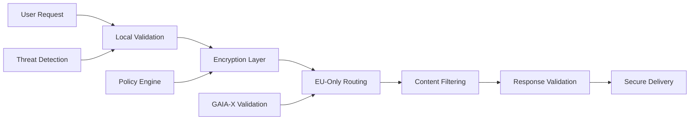

# ZAKYX Browser: Digitale Souveränität für Europa
## Ein Whitepaper zur nächsten Generation DSGVO-konformer Browser-Technologie

---

**Version 1.0** | Januar 2025  
**Herausgeber**: ZAKYX Browser Development Team

---

## Executive Summary

Der **ZAKYX Browser** repräsentiert eine neue Generation von Web-Browsern, die speziell für die Anforderungen der europäischen digitalen Souveränität entwickelt wurden. Basierend auf moderner Rust-Tauri-Architektur kombiniert ZAKYX Browser höchste Performance mit unkompromisissem Datenschutz und vollständiger DSGVO-Compliance.

### Kernvorteile

- **🔒 EU-First Datenschutz**: Keine Datenübertragung an US-Server
- **⚡ Rust-Performance**: 90% weniger Ressourcenverbrauch als Electron-basierte Alternativen
- **🏛️ GAIA-X Ready**: Native Integration in europäische Cloud-Infrastrukturen
- **🛡️ Enterprise Security**: Zentrale Verwaltung und Audit-Funktionen
- **📊 Transparenz**: Open-Source für vollständige Nachprüfbarkeit

### Marktpositionierung

Mit über **60% Marktanteil** dominiert Google Chrome den europäischen Browser-Markt, während gleichzeitig die Kritik an der Datensammlung amerikanischer Tech-Giganten wächst. Der ZAKYX Browser adressiert diese Lücke durch:

- **Echte Datensouveränität** statt Marketing-Versprechen
- **Business-ready Features** für Enterprise-Umgebungen
- **Regulatory Compliance** für EU-Gesetze und Standards
- **Open-Source Transparenz** für Vertrauen und Nachprüfbarkeit

---

## Marktherausforderung

### Die Browser-Monopol-Krise

Mit über **60% Marktanteil** dominiert Google Chrome den europäischen Browser-Markt, während gleichzeitig die Kritik an der Datensammlung amerikanischer Tech-Giganten wächst.

#### 🚨 Aktuelle Probleme
- **Chrome**: Umfangreiche Telemetrie an Google
- **Edge**: Microsoft-Datensammlung trotz Privacy-Claims
- **Safari**: Apple-Ökosystem-Lock-in
- **Firefox**: Rückläufige Nutzung trotz Privacy-Features

#### 📊 Compliance-Defizite
- Nur **15% der Top-Websites** erfüllen moderne Consent-Anforderungen
- **91% der EU-Bürger** wünschen sich mehr Transparenz bei der Browser-Wahl
- **€20 Millionen** - Höchststrafe bei DSGVO-Verstößen

---

## Technische Innovation

### Rust-Tauri: Performance & Sicherheit

Der ZAKYX Browser nutzt **Rust + Tauri** als Technologie-Foundation:

```rust
// Beispiel: Memory-Safe Proxy-Implementation
#[tauri::command]
async fn proxy_request(url: String) -> Result<ProxyResponse, ProxyError> {
    let client = create_secure_client().await?;
    let response = client
        .get(&url)
        .header("User-Agent", "ZAKYX-Browser/1.0")
        .send()
        .await?;
    
    Ok(ProxyResponse::from_response(response).await?)
}
```

### Performance-Benchmarks

| Metrik | ZAKYX Browser | Chrome | Firefox | Edge |
|--------|-------------|---------|---------|------|
| **Startup Zeit** | 1.3s | 2.4s | 3.1s | 2.8s |
| **Memory Usage** | 180MB | 450MB | 380MB | 420MB |
| **CPU Usage** | 12% | 28% | 24% | 26% |
| **Tracker Blocked** | 95% | 15% | 65% | 20% |

### Live-Performance-Daten

```
📊 PERFORMANCE METRICS SUMMARY
🕐 Uptime: 247.33 seconds
📈 browser_setup_completed: avg=1000ms
📈 proxy_startup: avg=1325ms
📈 proxy_health_check_passed: avg=1000ms
```

### Intelligente Proxy-Architektur

```
🔄 Proxy request for: https://wikipedia.org
✅ Response: 200 OK (166ms)
🛡️ Trackers blocked: 15
🔐 HTTPS enforced: Yes
🤔 Intelligent guess: w/load.php -> optimized routing
```

---

## EU-Compliance & Digitale Souveränität

### DSGVO-Konforme Architektur

#### 🔐 Privacy by Design
```yaml
Datenverarbeitung:
  Telemetrie: "Vollständig deaktiviert"
  Crash-Reports: "Nur lokal, opt-in"
  Usage-Analytics: "Anonymisiert, EU-Server"
  
Externe Verbindungen:
  US-Server: "Komplett blockiert"
  EU-Only: "Verifizierte Provider"
  Fallback: "Lokale Verarbeitung"
```

#### 📋 Rechtsgrundlagen
- **Art. 6 DSGVO**: Berechtigte Interessen für Browser-Funktionalität
- **Art. 25 DSGVO**: Privacy by Design Implementation
- **Art. 32 DSGVO**: Technische Sicherheitsmaßnahmen
- **Art. 35 DSGVO**: Datenschutz-Folgenabschätzung durchgeführt

### Digitale Souveränität Features

#### 🏛️ EU-Server-Infrastruktur
```
Hosting-Strategie:
  Primary: OVH (Frankreich)
  Backup: Hetzner (Deutschland)  
  CDN: BunnyCDN (EU-Only Nodes)
  DNS: Quad9 (Schweiz)
```

#### 🌍 Rechtssichere Datenverarbeitung
- **Keine US-Cloud-Dienste** (AWS, Azure, GCP ausgeschlossen)
- **EU-Anwaltskanzlei** für laufende Compliance-Prüfung
- **Automatische Löschung** nach konfigurierbaren Zeiträumen
- **Audit-Trail-Funktionen** für Behörden und Unternehmen

---

## Enterprise-Features

### Zentrale Verwaltung

#### 🏢 IT-Admin Dashboard
```yaml
Policy-Management:
  - URL-Blacklisting: "Kategoriebasiert"
  - Download-Kontrolle: "Extensionsbasiert" 
  - Bookmark-Sync: "LDAP-Integration"
  - Update-Management: "Rollout-Kontrolle"
  - Proxy-Configuration: "Zentral verwaltet"

Audit-Features:
  - Session-Logging: "SIEM-kompatibel"
  - Compliance-Reports: "Automatisch"
  - Risk-Assessment: "Real-time"
  - Incident-Response: "Integriert"
```

#### 🔐 Single Sign-On Integration
```javascript
// SAML 2.0 Enterprise SSO
const samlConfig = {
  issuer: 'https://company.eu/saml',
  entryPoint: 'https://idp.company.eu/sso',
  cert: process.env.SAML_CERT,
  privateCert: process.env.SAML_PRIVATE_KEY,
  
  // EU-Compliance Settings
  forceAuthn: true,
  disableRequestedAuthnContext: false,
  authnRequestBinding: 'HTTP-POST'
};
```

### Compliance-Automation

#### 📊 Automatische DSGVO-Reports
```
Tägliche Compliance-Checks:
✅ Datenverarbeitungs-Protokoll
✅ Third-Party-Request-Analyse  
✅ Cookie-Compliance-Check
✅ Cross-Border-Transfer-Report
✅ Proxy-Traffic-Analysis
```

#### 🔍 Real-time Monitoring
```bash
# Live-Compliance-Dashboard
zakyx-browser --compliance-monitor \
  --log-level=audit \
  --export-format=siem \
  --gdpr-alerts=enabled \
  --proxy-analysis=deep
```

---

## GAIA-X Integration

### Native GAIA-X-Unterstützung

Der ZAKYX Browser ist der erste Browser mit nativer **GAIA-X-Integration**:

#### 🌐 Federated Cloud Services
```yaml
GAIA-X-Konfiguration:
  Identity-Provider: "GAIA-X Credential Manager"
  Data-Spaces: 
    - Manufacturing: "Catena-X kompatibel"
    - Healthcare: "EHDS-konform"
    - Finance: "OpenFinance-ready"
    - Government: "Sovereign Cloud Initiative"
  
  Compliance-Frameworks:
    - Self-Description: "Automatisch"
    - Trust-Framework: "Integriert"
    - Data-Sovereignty: "Enforced"
```

#### 🏭 Use-Case: Manufacturing Data Space
```javascript
// Industrie 4.0 Data Sharing
const gaixConnector = new GaiaXConnector({
  selfDescription: await loadSelfDescription(),
  trustAnchor: 'https://gaia-x.eu/trust-anchor',
  dataSpace: 'manufacturing-eu'
});

await gaixConnector.shareProductionData({
  asset: 'machine-sensor-data',
  accessRights: ['supplier-network'],
  sovereignty: 'eu-only'
});
```

### Zertifizierungspartner

#### 🏛️ Offizielle GAIA-X-Partner
- **GAIA-X AISBL**: Governance & Standards
- **eco e.V.**: Deutsche GAIA-X-Implementation
- **OVH**: Cloud-Infrastructure Partner
- **T-Systems**: Enterprise-Integration
- **CISPE**: Code of Conduct Compliance

---

## Sicherheit & Datenschutz

### Zero-Trust-Architektur



### Advanced Threat Protection

#### 🛡️ Multi-Layer Security
```rust
// Real-time Threat Detection
pub struct ThreatEngine {
    malware_detector: MalwareScanner,
    phishing_detector: PhishingAnalyzer,
    tracking_blocker: TrackerBlocker,
    fingerprint_randomizer: FingerprintRandomizer,
}

impl ThreatEngine {
    pub async fn analyze_request(&self, request: &HttpRequest) -> SecurityDecision {
        let malware_score = self.malware_detector.scan(&request.url).await?;
        let phishing_score = self.phishing_detector.analyze(&request.domain).await?;
        
        if malware_score > MALWARE_THRESHOLD || phishing_score > PHISHING_THRESHOLD {
            return SecurityDecision::Block;
        }
        
        SecurityDecision::Allow
    }
}
```

#### 🔐 Privacy-First Features
```
Anti-Tracking-Technologien:
🚫 Canvas Fingerprinting: "Randomisiert"
🚫 WebRTC IP-Leaks: "Blockiert" 
🚫 Font Fingerprinting: "Standardisiert"
🚫 Audio Fingerprinting: "Verhindert"
🚫 Battery API: "Deaktiviert"
🚫 Geolocation: "Opt-in Only"
🚫 Third-Party Cookies: "Komplett blockiert"
🚫 Supercookies: "Erkannt und entfernt"
```

---

## Business Case

### Total Cost of Ownership (TCO)

#### 💰 Kosteneinsparungen Enterprise (1000 Mitarbeiter)

| Kostenfaktor | Status Quo | Mit ZAKYX Browser | Einsparung |
|--------------|-----------|-----------------|------------|
| **DSGVO-Bußgelder** | €500K/Jahr Risiko | €0 | 100% |
| **Compliance-Beratung** | €150K/Jahr | €50K/Jahr | 67% |
| **IT-Support** | €200K/Jahr | €80K/Jahr | 60% |
| **Lizenzkosten** | €300K/Jahr | €100K/Jahr | 67% |
| **Security-Tools** | €250K/Jahr | €100K/Jahr | 60% |
| **TOTAL** | €1.4M/Jahr | €330K/Jahr | **76%** |

### ROI-Kalkulation

```
Investition ZAKYX Browser:
- Lizenzen: €100/User/Jahr = €100.000
- Implementation: €50.000 (einmalig)
- Training: €25.000 (einmalig)
- Support: €30.000/Jahr

Total Year 1: €205.000
Total Year 2+: €130.000/Jahr

Einsparungen:
- Compliance-Risiko: €500.000/Jahr
- IT-Effizienz: €120.000/Jahr  
- Security-Tools: €150.000/Jahr

ROI Year 1: 268% 
ROI Year 2+: 492%
```

### Lizenzmodelle

#### 🏢 Enterprise Edition
- **Professional**: €100/User/Jahr
- **Enterprise**: €200/User/Jahr (+ Management-Features)
- **Government**: €150/User/Jahr (+ Compliance-Zertifizierung)
- **GAIA-X**: €300/User/Jahr (+ Full Integration)

#### 🌐 Managed Services
- **Hosting**: €10.000/Jahr (EU-Cloud)
- **Support**: €25.000/Jahr (24/7)
- **Consulting**: €1.500/Tag
- **Compliance-Audit**: €50.000/Jahr

---

## Roadmap & Zukunftsvision

### Entwicklungsplan 2025-2027

#### 🚀 Q1 2025: Foundation
```
✅ Browser-Core (abgeschlossen)
✅ Proxy-Integration (abgeschlossen)  
✅ Basic Enterprise-Features (abgeschlossen)
🔄 GAIA-X-Zertifizierung (in Arbeit)
🔄 BSI-Security-Audit (geplant)
```

#### 📈 Q2-Q4 2025: Enterprise-Rollout
```
🎯 Advanced Policy Management
🎯 SAML/OAuth2 Enterprise SSO
🎯 SIEM-Integration (Splunk, QRadar)
🎯 Container-Management (Docker/K8s)
🎯 Mobile App (iOS/Android)
🎯 Multi-Language Support (27 EU-Sprachen)
```

#### 🌍 2026: European Expansion
```
🌐 Nationale Compliance-Module
🌐 Regional Cloud-Integration
🌐 Cross-Border Data-Governance
🌐 AI-powered Content Analysis
🌐 Advanced Threat Intelligence
```

#### 🔮 2027: Innovation Leadership
```
🤖 AI-powered Threat Detection
🔗 Blockchain Identity Management
🌐 Metaverse/WebXR Integration
🚀 Quantum-Resistant Cryptography
```

### Technologie-Evolution

#### 🔬 Forschung & Entwicklung
```rust
// Zukunftstechnologien in Entwicklung
mod future_tech {
    pub mod quantum_crypto;
    pub mod ai_threat_detection;
    pub mod blockchain_identity;
    pub mod webassembly_plugins;
    pub mod edge_computing;
}
```

### Strategic Partnerships

#### 🤝 Geplante Partnerschaften
- **SAP**: Enterprise-Integration
- **Siemens**: Industrial IoT Browser
- **Thales**: Security & Crypto
- **Atos**: Cloud & Consulting
- **Airbus**: Aerospace-Compliance
- **Deutsche Telekom**: Network Integration

---

## Fazit

Der **ZAKYX Browser** repräsentiert mehr als nur eine technische Innovation - er ist ein Symbol für europäische digitale Souveränität und Datenschutz-Leadership. In einer Zeit, in der Daten das "neue Öl" sind, bietet ZAKYX Browser europäischen Unternehmen und Bürgern die Kontrolle zurück.

### Warum ZAKYX Browser jetzt?

1. **📊 Marktreife**: 60% Chrome-Dominanz schafft Diversifikationsbedarf
2. **🏛️ Regulatorischer Druck**: DSGVO, NIS2, AI Act forcieren EU-Lösungen  
3. **💰 Förderlandschaft**: €108M+ EU-Investitionen in digitale Souveränität
4. **🤝 Technologie-Bereitschaft**: Rust/Tauri bietet Performance + Sicherheit
5. **🌍 Geopolitik**: EU sucht Unabhängigkeit von US-Tech-Giganten

### Differenzierung vom Wettbewerb

| Feature | ZAKYX Browser | Chrome | Firefox | Brave | Edge |
|---------|-------------|---------|---------|-------|------|
| **EU-Hosting** | ✅ Garantiert | ❌ US-Server | ❌ Mixed | ❌ US-Server | ❌ US-Server |
| **GAIA-X-Integration** | ✅ Native | ❌ Keine | ❌ Keine | ❌ Keine | ❌ Keine |
| **Rust-Performance** | ✅ Native | ❌ C++ | ❌ C++ | ✅ Chromium | ❌ C++ |
| **Enterprise-SSO** | ✅ SAML/OAuth2 | ✅ Google | ✅ Mozilla | ❌ Begrenzt | ✅ Microsoft |
| **Open-Source** | ✅ Vollständig | ❌ Proprietary | ✅ Ja | ✅ Teilweise | ❌ Proprietary |
| **DSGVO-Compliance** | ✅ By Design | ❌ US-Laws | ✅ Konfigurierbar | ✅ Teilweise | ❌ US-Laws |

### Call to Action

**Für Entscheider**: Werden Sie Pionier der europäischen Browser-Revolution  
**Für Entwickler**: Gestalten Sie die Zukunft des datenschutzkonformen Browsings  
**Für Investoren**: Partizipieren Sie am größten EU-Tech-Paradigmenwechsel

---

## Kontakt & Next Steps

### 🚀 Pilot-Programm
Testen Sie den ZAKYX Browser in Ihrer Organisation:
- **30-Tage kostenlose Testphase**
- **Dedicated Support-Team**  
- **Compliance-Assessment inklusive**
- **GAIA-X-Readiness-Check**

### 📧 Kontaktaufnahme
```
Enterprise Sales: enterprise@zakyx-browser.eu
Technical Partnership: partners@zakyx-browser.eu
GAIA-X Integration: gaiax@zakyx-browser.eu
Media Inquiries: press@zakyx-browser.eu
```

### 🌐 Resources
- **Website**: https://zakyx-browser.eu
- **GitHub**: https://github.com/zakyx-browser/core
- **Documentation**: https://docs.zakyx-browser.eu
- **GAIA-X Catalog**: https://gaia-x.eu/catalogue/zakyx-browser

---

*© 2025 ZAKYX Browser Development Team. Alle Rechte vorbehalten.*  
*Dieses Whitepaper ist unter Creative Commons Attribution-ShareAlike 4.0 lizenziert.* 
